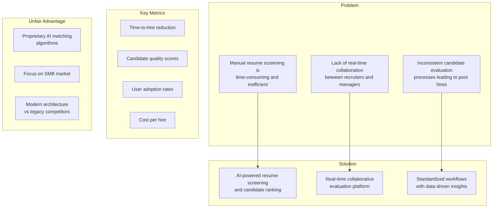
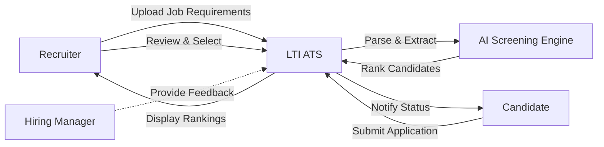
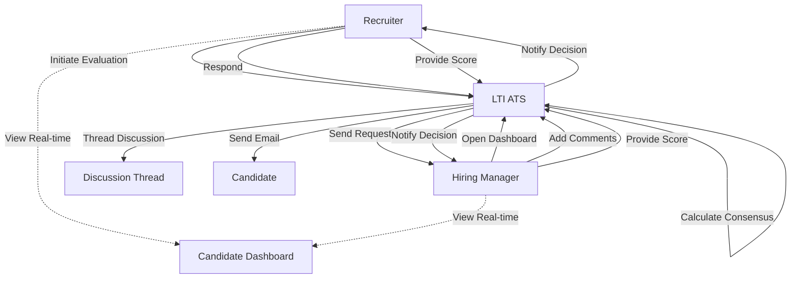
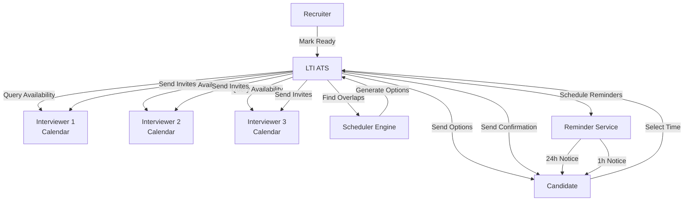
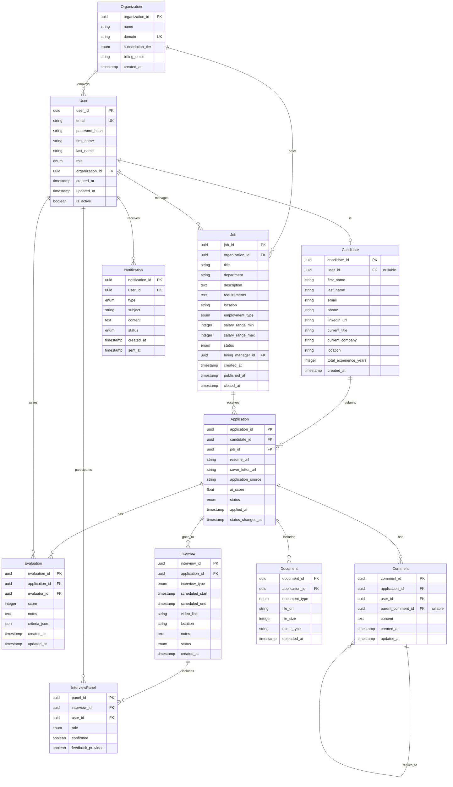
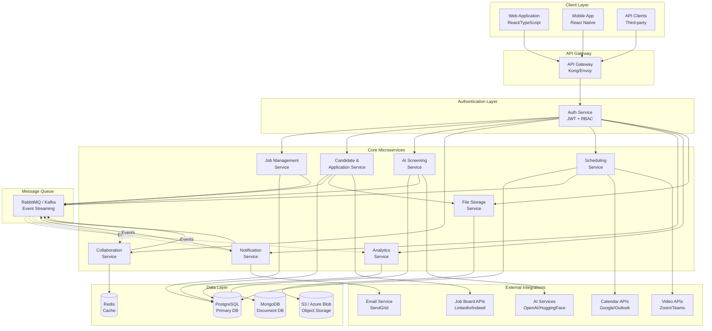
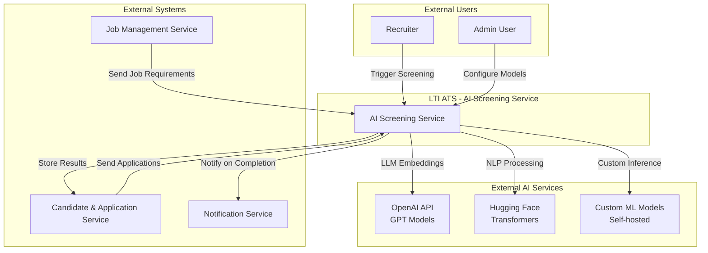
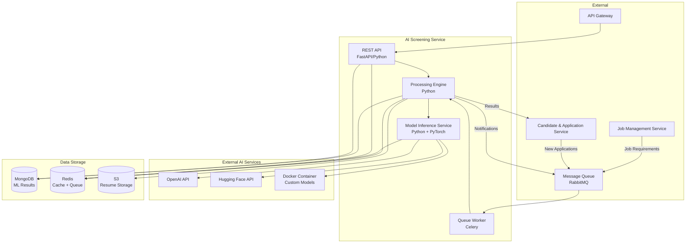
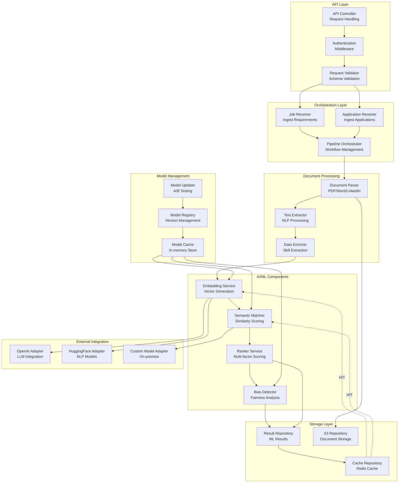
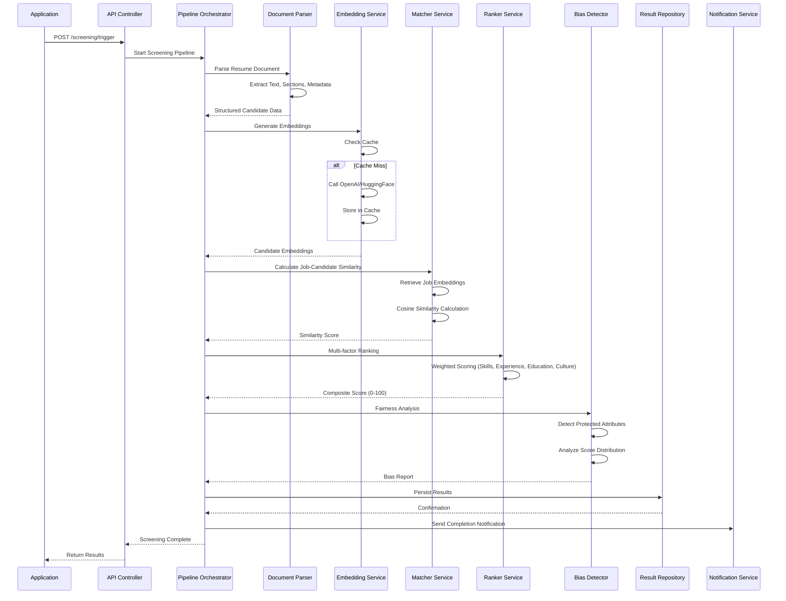

# LTI - Applicant Tracking System (ATS)

## 1. Business Description

### Overview

LTI is an Applicant Tracking System (ATS) designed to revolutionize the recruitment process for modern organizations. Unlike traditional ATS platforms that focus primarily on managing applications and resumes, LTI leverages cutting-edge AI technology and real-time collaboration features to create a smarter, more efficient hiring ecosystem.

### Value Proposition

**For HR Departments:**
- **Reduce time-to-hire by 40%**: Automated resume screening and candidate ranking eliminate manual filtering
- **Increase recruiter productivity by 50%**: AI-assisted candidate matching and intelligent scheduling optimize workflows
- **Improve hiring quality**: Data-driven insights and collaborative feedback loops ensure better hiring decisions
- **Streamlined candidate experience**: Automated communications and self-service interview scheduling reduce friction

**For Hiring Teams:**
- **Real-time collaboration**: Live candidate evaluations, shared interview notes, and instant feedback loops
- **Intelligent automation**: Smart scheduling coordination across multiple interviewers and time zones
- **Unified communication**: Centralized messaging reduces email chaos and missed communications

### Competitive Advantages

1. **AI-Powered Intelligence**: 
   - Advanced resume parsing and semantic matching that goes beyond keyword search
   - Predictive analytics for candidate success potential
   - Automated bias detection to ensure fair hiring practices

2. **Real-Time Collaboration Platform**:
   - Live candidate dashboards with instant updates
   - Collaborative evaluation workflows with threaded discussions
   - Integrated video interview capabilities

3. **End-to-End Automation**:
   - Intelligent interview scheduling with automatic conflict resolution
   - Automated candidate nurturing and engagement campaigns
   - Smart document verification and background check integration

4. **Modern User Experience**:
   - Intuitive interface designed for mobile-first workflows
   - Zero learning curve with guided onboarding
   - Customizable workflows to match any hiring process

5. **Data-Driven Insights**:
   - Real-time hiring pipeline analytics
   - Source effectiveness tracking and attribution
   - Predictive hiring forecasts and budget optimization

### Target Market

**Primary Customers:**
- Mid-market companies (100-1000 employees) seeking modern HR technology
- Growing startups requiring scalable recruitment infrastructure
- Companies with distributed/hybrid teams needing collaboration tools
- Organizations prioritizing diversity, equity, and inclusion initiatives

**Market Opportunity:**
The global ATS market is projected to reach $6.5B by 2028, growing at 6.2% CAGR. Current solutions are legacy-heavy, lack modern UX, and provide limited AI capabilities.

---

## 2. Lean Canvas



### Lean Canvas Details

| Block | Content |
|-------|---------|
| **Problem** | 1) Manual resume screening consumes 70% of recruiter time<br/>2) Poor communication between recruiters and hiring managers causes delays<br/>3) Lack of consistency in candidate evaluation leads to biased decisions |
| **Customer Segments** | 1) Mid-market companies (100-1000 employees)<br/>2) Growing startups scaling hiring<br/>3) Companies prioritizing D&I initiatives<br/>4) Distributed teams needing collaboration tools |
| **Unique Value Proposition** | "The only ATS that combines AI-powered screening, real-time collaboration, and intelligent automation to cut time-to-hire by 40% and improve candidate quality" |
| **Solution** | • AI resume screening with semantic matching<br/>• Real-time collaborative evaluation platform<br/>• Intelligent interview scheduling<br/>• Automated candidate communications<br/>• Data-driven hiring insights<br/>• Mobile-first user experience |
| **Channels** | • Inbound marketing and SEO<br/>• Content marketing (HR blogs, podcasts)<br/>• Partnerships with HR consultancies<br/>• Freemium model with upgrade prompts<br/>• Sales team for enterprise accounts |
| **Revenue Streams** | • Subscription fees (per user/month): $50-150<br/>• Professional services (implementation, training)<br/>• Premium AI features (advanced analytics)<br/>• Marketplace for integrations |
| **Cost Structure** | • Engineering team (AI/ML specialists)<br/>• Cloud infrastructure (AWS/Azure)<br/>• Sales and marketing<br/>• Customer success team |
| **Key Metrics** | • Monthly Active Users (MAU)<br/>• Customer Acquisition Cost (CAC)<br/>• Lifetime Value (LTV)<br/>• Time-to-hire reduction<br/>• Customer retention rate<br/>• Net Promoter Score (NPS) |
| **Unfair Advantage** | • Proprietary AI matching algorithms<br/>• Focus on underserved SMB market<br/>• Modern cloud-native architecture<br/>• Expertise in HR tech domain |

---

## 3. Main Functionalities

### 3.1 AI-Powered Candidate Screening

**Overview**: Automatically parse, analyze, and rank candidates based on job requirements using advanced NLP and machine learning.

**Key Features**:
- Multi-format resume parsing (PDF, Word, LinkedIn import)
- Semantic matching beyond keywords
- Skill extraction and competency mapping
- Cultural fit scoring
- Bias detection algorithms

**Business Value**: Reduces initial screening time from 5 hours to 30 minutes per 100 candidates.

### 3.2 Real-Time Collaborative Evaluation

**Overview**: Enable seamless collaboration between recruiters, hiring managers, and interviewers throughout the hiring process.

**Key Features**:
- Live candidate dashboards with instant updates
- Threaded discussion threads on candidates
- Side-by-side candidate comparison
- Shared interview notes and feedback
- Voting and consensus mechanisms

**Business Value**: Improves decision speed by 50% and candidate experience through coordinated communication.

### 3.3 Intelligent Interview Scheduling

**Overview**: Automatically coordinate interview schedules across multiple interviewers, time zones, and candidate preferences.

**Key Features**:
- Calendar integration (Google, Outlook, iCal)
- Automatic conflict detection and resolution
- Time zone management
- Candidate self-service scheduling
- Interview kit preparation (questions, resumes, rubrics)
- Reminder automation

**Business Value**: Reduces scheduling overhead from 2 hours to 15 minutes per candidate.

### 3.4 Automated Candidate Communication

**Overview**: Maintain consistent, personalized communication with candidates throughout the hiring funnel.

**Key Features**:
- Email template library
- Automated status updates
- Personalization based on candidate profile
- Multi-channel support (email, SMS, Slack)
- A/B testing capabilities

**Business Value**: Improves candidate response rates by 35% and reduces ghosting.

### 3.5 Analytics and Insights

**Overview**: Provide data-driven insights to optimize hiring strategy and process efficiency.

**Key Features**:
- Real-time hiring pipeline dashboards
- Source effectiveness tracking
- Time-to-hire analytics
- Cost per hire calculations
- Predictive hiring forecasts
- D&I metrics and reporting

**Business Value**: Enables data-driven hiring decisions and process optimization.

---

## 4. Use Cases

### Use Case 1: AI-Assisted Resume Screening

**Description**: Recruiter uses AI to automatically screen and rank incoming job applications.

**Actors**:
- Primary: Recruiter
- Secondary: Hiring Manager, Candidate

**Preconditions**:
- Job posting is published and live
- Recruiter has access to the LTI ATS platform
- AI screening models are configured for the job requirements

**Main Success Scenario**:
1. System automatically imports new applications from job boards
2. AI engine parses resumes and extracts candidate information
3. System performs semantic matching against job requirements
4. Candidates are ranked by relevance score (0-100)
5. Recruiter reviews top candidates on dashboard
6. Recruiter can adjust ranking criteria based on feedback
7. Recruiter moves qualified candidates to "Shortlist" stage
8. System notifies candidates about their status

**Alternative Flows**:
- **4a**: No candidates meet minimum threshold
  - System notifies recruiter
  - Recruiter may adjust requirements
- **5a**: Recruiter disagrees with AI ranking
  - Recruiter provides feedback
  - System learns from feedback for future rankings

**Postconditions**:
- Qualified candidates are in "Shortlist" stage
- All candidates receive status update notifications
- AI models are updated with new feedback data

**Use Case Diagram**:



---

### Use Case 2: Collaborative Candidate Evaluation

**Description**: Recruiter and hiring manager collaborate in real-time to evaluate shortlisted candidates.

**Actors**:
- Primary: Recruiter, Hiring Manager
- Secondary: Interviewer, Candidate

**Preconditions**:
- Candidates are in "Shortlist" stage
- Hiring manager is assigned to the job
- Both recruiter and hiring manager have platform access

**Main Success Scenario**:
1. Recruiter sends evaluation request to hiring manager
2. Hiring manager opens candidate profile dashboard
3. Both users can view candidate information simultaneously
4. Hiring manager reviews resume and adds comments
5. Recruiter responds to comments in threaded discussion
6. Both users access shared interview notes from past interviews
7. Hiring manager provides evaluation score (1-5 stars)
8. Recruiter adds own evaluation score
9. System calculates weighted average consensus score
10. If score meets threshold, candidate advances to next stage
11. System notifies both users of decision

**Alternative Flows**:
- **4a**: Disagreement on candidate evaluation
  - System initiates consensus workflow
  - Additional stakeholders added to discussion
  - Voting mechanism activated
- **10a**: Score below threshold
  - Candidate marked as "Rejected"
  - System sends polite rejection email
  - Candidate enters talent pool

**Postconditions**:
- Candidate has collaborative evaluation record
- Decision is documented in system
- All stakeholders receive decision notification

**Use Case Diagram**:



---

### Use Case 3: Automated Interview Scheduling

**Description**: System automatically coordinates interview scheduling between candidates and multiple interviewers.

**Actors**:
- Primary: Recruiter, Candidate, Interviewer
- Secondary: System (automation)

**Preconditions**:
- Candidate is approved for interview stage
- Interview requirements are defined (panel composition, duration, format)
- All interviewers have calendar integration enabled

**Main Success Scenario**:
1. Recruiter marks candidate as "Ready for Interview"
2. System retrieves interview requirements (panel, duration, type)
3. System queries available time slots from all interviewer calendars
4. System identifies overlapping availability across panel
5. System generates 3 proposed time slot options
6. Candidate receives email with calendar link and options
7. Candidate selects preferred time slot
8. System sends calendar invites to all interviewers
9. System sends confirmation and preparation kit to candidate
10. System sends reminder notifications 24h and 1h before interview
11. On interview day, system provides interview room link and materials

**Alternative Flows**:
- **5a**: No overlapping availability found
  - System alerts recruiter
  - Recruiter manually adjusts requirements
  - Process restarts
- **7a**: Candidate requests custom time
  - Candidate provides alternative times
  - System re-checks availability
  - Offers new options if available
- **10a**: Interviewer cancels
  - System notifies recruiter immediately
  - System identifies backup interviewer
  - New invites sent if backup available

**Postconditions**:
- All stakeholders have confirmed calendar events
- Interview links and materials are distributed
- Reminder notifications are scheduled

**Use Case Diagram**:



---

## 5. Data Model

### Entity-Relationship Model

**Core Entities**:

1. **User**
   - user_id (UUID, Primary Key)
   - email (String, Unique, Not Null)
   - password_hash (String, Not Null)
   - first_name (String, Not Null)
   - last_name (String, Not Null)
   - role (Enum: RECRUITER, HIRING_MANAGER, ADMIN, CANDIDATE)
   - organization_id (UUID, Foreign Key)
   - created_at (Timestamp)
   - updated_at (Timestamp)
   - is_active (Boolean)

2. **Organization**
   - organization_id (UUID, Primary Key)
   - name (String, Not Null)
   - domain (String, Unique)
   - subscription_tier (Enum: FREE, BASIC, PRO, ENTERPRISE)
   - billing_email (String)
   - created_at (Timestamp)

3. **Job**
   - job_id (UUID, Primary Key)
   - organization_id (UUID, Foreign Key)
   - title (String, Not Null)
   - department (String)
   - description (Text)
   - requirements (Text)
   - location (String)
   - employment_type (Enum: FULL_TIME, PART_TIME, CONTRACT)
   - salary_range_min (Integer)
   - salary_range_max (Integer)
   - status (Enum: DRAFT, PUBLISHED, CLOSED)
   - hiring_manager_id (UUID, Foreign Key)
   - created_at (Timestamp)
   - published_at (Timestamp)
   - closed_at (Timestamp)

4. **Candidate**
   - candidate_id (UUID, Primary Key)
   - user_id (UUID, Foreign Key, Nullable)
   - first_name (String, Not Null)
   - last_name (String, Not Null)
   - email (String, Not Null)
   - phone (String)
   - linkedin_url (String)
   - current_title (String)
   - current_company (String)
   - location (String)
   - total_experience_years (Integer)
   - created_at (Timestamp)

5. **Application**
   - application_id (UUID, Primary Key)
   - candidate_id (UUID, Foreign Key)
   - job_id (UUID, Foreign Key)
   - resume_url (String, Not Null)
   - cover_letter_url (String)
   - application_source (String)
   - ai_score (Float)
   - status (Enum: APPLIED, SCREENING, SHORTLISTED, INTERVIEW, OFFER, HIRED, REJECTED)
   - applied_at (Timestamp)
   - status_changed_at (Timestamp)

6. **Evaluation**
   - evaluation_id (UUID, Primary Key)
   - application_id (UUID, Foreign Key)
   - evaluator_id (UUID, Foreign Key)
   - score (Integer, Range: 1-5)
   - notes (Text)
   - criteria_json (JSON)
   - created_at (Timestamp)
   - updated_at (Timestamp)

7. **Interview**
   - interview_id (UUID, Primary Key)
   - application_id (UUID, Foreign Key)
   - interview_type (Enum: PHONE, VIDEO, ONSITE, PANEL)
   - scheduled_start (Timestamp)
   - scheduled_end (Timestamp)
   - video_link (String)
   - location (String)
   - notes (Text)
   - status (Enum: SCHEDULED, COMPLETED, CANCELLED, NO_SHOW)
   - created_at (Timestamp)

8. **InterviewPanel**
   - panel_id (UUID, Primary Key)
   - interview_id (UUID, Foreign Key)
   - user_id (UUID, Foreign Key)
   - role (Enum: INTERVIEWER, OBSERVER)
   - confirmed (Boolean, Default: False)
   - feedback_provided (Boolean, Default: False)

9. **Comment**
   - comment_id (UUID, Primary Key)
   - application_id (UUID, Foreign Key)
   - user_id (UUID, Foreign Key)
   - parent_comment_id (UUID, Foreign Key, Nullable)
   - content (Text, Not Null)
   - created_at (Timestamp)
   - updated_at (Timestamp)

10. **Document**
    - document_id (UUID, Primary Key)
    - application_id (UUID, Foreign Key)
    - document_type (Enum: RESUME, COVER_LETTER, PORTFOLIO, CERTIFICATE)
    - file_url (String, Not Null)
    - file_size (Integer)
    - mime_type (String)
    - uploaded_at (Timestamp)

11. **Notification**
    - notification_id (UUID, Primary Key)
    - user_id (UUID, Foreign Key)
    - type (Enum: EMAIL, SMS, IN_APP, SLACK)
    - subject (String)
    - content (Text, Not Null)
    - status (Enum: PENDING, SENT, FAILED)
    - created_at (Timestamp)
    - sent_at (Timestamp)

### Relationships

```
Organization (1) ---< (N) User
Organization (1) ---< (N) Job
User (1) ---< (N) Job [as hiring_manager]
User (1) ---< (N) Candidate [optional]
Candidate (1) ---< (N) Application
Job (1) ---< (N) Application
Application (1) ---< (N) Evaluation
Application (1) ---< (N) Interview
Application (1) ---< (N) Comment
Application (1) ---< (N) Document
User (1) ---< (N) Evaluation [as evaluator]
User (1) ---< (N) Notification
Interview (1) ---< (N) InterviewPanel
User (1) ---< (N) InterviewPanel
Comment (1) ---< (N) Comment [as parent_comment]
```

### Entity-Relationship Diagram



---

## 6. System Design

### 6.1 Architecture Overview

LTI ATS follows a **microservices architecture** pattern with clear separation of concerns, enabling scalability, maintainability, and independent deployment of services. The system is built cloud-native, leveraging modern containerization and orchestration technologies.

### 6.2 Architecture Style: Microservices

**Why Microservices?**
- **Scalability**: Independent scaling of services based on demand (e.g., AI service scales differently than API service)
- **Team Autonomy**: Small teams can own and deploy services independently
- **Technology Diversity**: Each service can use the best tech stack for its purpose
- **Fault Isolation**: Failures in one service don't cascade to others
- **Easier Maintenance**: Smaller codebases are easier to understand and modify

### 6.3 Core Components

#### 1. **API Gateway Layer**
- **Purpose**: Single entry point for all client requests
- **Responsibilities**: 
  - Request routing to appropriate microservices
  - Authentication and authorization
  - Rate limiting and throttling
  - Request/response transformation
  - API versioning

#### 2. **Authentication & Authorization Service**
- **Purpose**: Centralized user management and security
- **Responsibilities**:
  - User registration and login
  - JWT token generation and validation
  - Role-based access control (RBAC)
  - Single Sign-On (SSO) integration
  - Multi-factor authentication (MFA)

#### 3. **Job Management Service**
- **Purpose**: Manage job postings and requirements
- **Responsibilities**:
  - CRUD operations for jobs
  - Job publishing workflows
  - Integration with job boards
  - Job analytics and metrics

#### 4. **Candidate & Application Service**
- **Purpose**: Handle candidate profiles and applications
- **Responsibilities**:
  - Candidate profile management
  - Application submission and tracking
  - Document storage and management
  - Application status workflows

#### 5. **AI Screening Service**
- **Purpose**: AI-powered candidate evaluation
- **Responsibilities**:
  - Resume parsing and extraction
  - Semantic matching algorithms
  - Candidate scoring and ranking
  - Bias detection and mitigation
  - Skill extraction and competency mapping

#### 6. **Collaboration Service**
- **Purpose**: Real-time collaborative features
- **Responsibilities**:
  - Live candidate dashboards
  - Comment and discussion threads
  - Real-time notifications (WebSocket)
  - Evaluation workflows

#### 7. **Scheduling Service**
- **Purpose**: Interview coordination and calendar management
- **Responsibilities**:
  - Calendar integrations (Google, Outlook, iCal)
  - Availability detection
  - Automatic schedule optimization
  - Interview reminders and notifications
  - Video link generation

#### 8. **Notification Service**
- **Purpose**: Multi-channel communication
- **Responsibilities**:
  - Email delivery (transactional and marketing)
  - SMS notifications
  - In-app notifications
  - Slack/Teams integrations
  - Template management

#### 9. **Analytics Service**
- **Purpose**: Data aggregation and insights
- **Responsibilities**:
  - Hiring pipeline metrics
  - Time-to-hire calculations
  - Source effectiveness tracking
  - D&I reporting
  - Predictive analytics

#### 10. **File Storage Service**
- **Purpose**: Document and media management
- **Responsibilities**:
  - Resume and document storage
  - Cloud storage integration (S3, Azure Blob)
  - CDN delivery for performance
  - File processing and validation

### 6.4 Supporting Infrastructure

#### **Message Queue**
- **Technology**: RabbitMQ / Apache Kafka
- **Purpose**: Asynchronous communication between services
- **Use Cases**: 
  - Event-driven workflows
  - Background job processing
  - Real-time event streaming

#### **Caching Layer**
- **Technology**: Redis
- **Purpose**: Reduce database load and improve response times
- **Use Cases**:
  - Session management
  - Frequently accessed data
  - Rate limiting counters

#### **Database Strategy**
- **Primary DB**: PostgreSQL (relational data)
- **Analytics DB**: ClickHouse / Snowflake (time-series data)
- **Document DB**: MongoDB (flexible schemas for AI outputs)
- **Object Storage**: AWS S3 / Azure Blob (files)

#### **Service Mesh**
- **Technology**: Istio / Linkerd
- **Purpose**: Service-to-service communication management
- **Features**:
  - Load balancing
  - Circuit breakers
  - Retry logic
  - Distributed tracing

### 6.5 External Integrations

- **Calendar**: Google Calendar API, Microsoft Graph API, Calendly
- **Email**: SendGrid, AWS SES
- **SMS**: Twilio
- **Video**: Zoom API, Microsoft Teams API
- **AI/ML**: OpenAI API, Hugging Face, custom models
- **Job Boards**: LinkedIn, Indeed, Glassdoor APIs
- **Background Checks**: Checkr API
- **Identity**: Okta, Auth0

### 6.6 Technology Stack

**Backend:**
- **Runtime**: Node.js (TypeScript), Python (FastAPI)
- **Frameworks**: Express.js, FastAPI, NestJS
- **Databases**: PostgreSQL, MongoDB, Redis
- **Message Queue**: RabbitMQ / Kafka
- **Container Runtime**: Docker
- **Orchestration**: Kubernetes

**Frontend:**
- **Framework**: React (TypeScript)
- **State Management**: Redux / Zustand
- **UI Library**: Material-UI / Chakra UI
- **Real-time**: Socket.io client

**DevOps:**
- **CI/CD**: GitHub Actions / GitLab CI
- **Monitoring**: Prometheus, Grafana
- **Logging**: ELK Stack (Elasticsearch, Logstash, Kibana)
- **Tracing**: Jaeger / Zipkin
- **Cloud**: AWS / Azure / GCP

**AI/ML:**
- **Frameworks**: PyTorch, TensorFlow, Scikit-learn
- **NLP**: spaCy, NLTK, transformers
- **Storage**: Weights & Biases, MLflow

### 6.7 High-Level Architecture Diagram



### 6.8 Key Design Patterns

1. **API Gateway Pattern**: Single entry point for all clients
2. **Circuit Breaker**: Prevent cascade failures
3. **Event-Driven Architecture**: Loose coupling via messaging
4. **CQRS**: Separate read and write models for performance
5. **Saga Pattern**: Manage distributed transactions
6. **Retry with Exponential Backoff**: Handle transient failures
7. **Bulkhead**: Isolate critical resources

### 6.9 Scalability Considerations

- **Horizontal Scaling**: Stateless services can scale independently
- **Database Sharding**: Partition by organization_id
- **CDN**: Cache static assets globally
- **Auto-scaling**: Kubernetes HPA based on CPU/memory/custom metrics
- **Load Balancing**: Round-robin, least-connections, weighted

### 6.10 Security Considerations

- **Authentication**: OAuth 2.0, JWT tokens, MFA
- **Authorization**: RBAC with fine-grained permissions
- **Data Encryption**: TLS in transit, encryption at rest
- **API Security**: Rate limiting, input validation, SQL injection prevention
- **Compliance**: GDPR, SOC 2, data residency options
- **Audit Logging**: Track all sensitive operations

---

## 7. C4 Diagrams

### Selected Component: AI Screening Service

The AI Screening Service is chosen for deep dive as it represents LTI's core competitive advantage and involves complex integration with multiple data sources and ML models.

### 7.1 Level 1: System Context



**Description**: The AI Screening Service acts as a central intelligence layer that receives job requirements and candidate applications, processes them through AI/ML pipelines, and returns ranked candidate scores. It integrates with external AI services for various processing tasks and communicates with other LTI microservices to complete the screening workflow.

### 7.2 Level 2: Container Diagram



**Technology Choices**:
- **API**: FastAPI for high-performance async processing
- **Processing**: Custom Python engine for orchestration
- **ML Inference**: PyTorch for flexibility and model management
- **Queue**: Celery + Redis for distributed task processing
- **Storage**: MongoDB for flexible ML results, S3 for documents
- **Cache**: Redis for frequently accessed models and results

### 7.3 Level 3: Component Diagram



**Key Components**:

1. **API Layer**: Handles incoming HTTP requests, authentication, and validation
2. **Orchestration Layer**: Manages the end-to-end screening workflow
3. **Document Processing**: Parses and extracts structured data from resumes
4. **AI/ML Components**: Core intelligence - embeddings, matching, ranking, bias detection
5. **Model Management**: Handles model versioning, caching, and updates
6. **Storage Layer**: Persists results and caches frequently accessed data
7. **External Integration**: Adapters for various AI/ML services

### 7.4 Processing Flow



**Performance Optimizations**:
- **Caching**: Embedding results cached for 24 hours to avoid redundant API calls
- **Batch Processing**: Multiple candidates processed in parallel
- **Async Processing**: Non-blocking operations for external API calls
- **Streaming**: Partial results returned as they're computed

### 7.5 Model Details

**Embedding Model**: `text-embedding-3-large` (OpenAI) - 3072 dimensions
**Matching**: Cosine similarity with configurable threshold
**Ranking Formula**: 
```
Final Score = 0.40 × Skills Match + 0.30 × Experience + 0.15 × Education + 0.10 × Cultural Fit + 0.05 × Soft Skills
```

**Bias Detection**: 
- Demographic parity metrics
- Predictive parity checks
- Equalized odds analysis
- Statistical significance testing

---

## 8. Summary

LTI ATS represents a next-generation approach to applicant tracking, combining intelligent automation with human-centered design. By leveraging AI for repetitive tasks, enabling real-time collaboration, and providing data-driven insights, LTI helps organizations not just hire faster, but hire better.

The microservices architecture ensures scalability and maintainability, while the comprehensive data model captures the complexity of modern hiring workflows. The AI Screening Service, as demonstrated in the C4 deep dive, exemplifies how cutting-edge technology can be seamlessly integrated to deliver measurable business value.

**Key Differentiators:**
- AI-first approach with proprietary algorithms
- Real-time collaboration reducing time-to-hire
- Modern tech stack ensuring performance and reliability
- Focus on fairness and bias mitigation
- End-to-end automation reducing manual overhead

**Success Metrics:**
- 40% reduction in time-to-hire
- 50% improvement in recruiter productivity
- 35% increase in candidate response rates
- Sub-second API response times
- 99.9% uptime SLA

This specification serves as the foundation for building a world-class ATS that transforms how organizations attract, evaluate, and hire talent.

